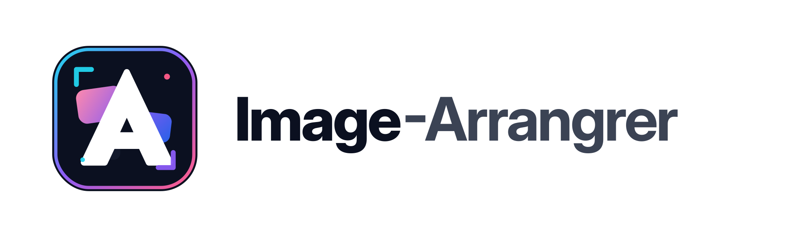
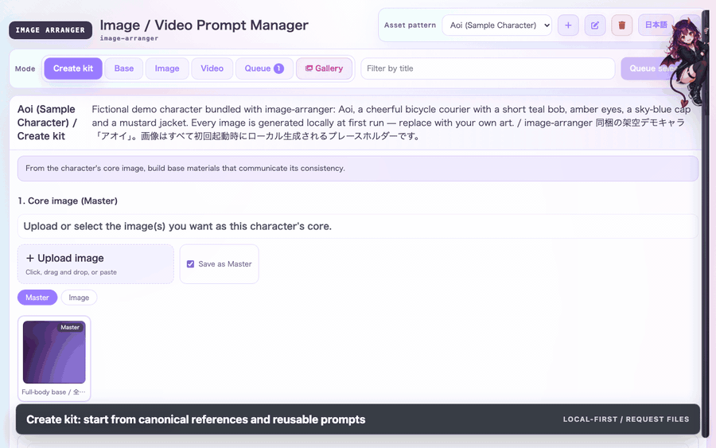
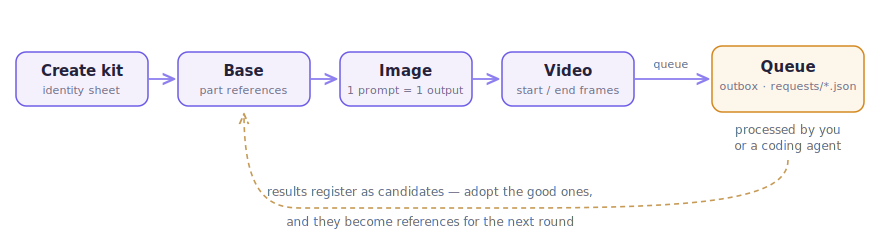

<div align="center">



# image-arranger

**A local-first prompt & asset request manager for AI image / video generation —<br>it doesn't generate, it keeps your generation workflow organized.**

[](https://github.com/aiarranger/image-arranger/actions/workflows/ci.yml)
[](LICENSE)
[](#quick-start)
[](#quick-start)

[Landing page](https://aiarranger.github.io/image-arranger/) · [2-minute overview GIF](https://raw.githubusercontent.com/aiarranger/image-arranger/main/docs/assets/marketing/image-arranger-overview-en.gif) · [Quick Start](#quick-start) · [How requests flow](#how-requests-flow) · [日本語 README](README.ja.md)

<p><strong>2-minute service overview (English)</strong></p>
<a href="https://raw.githubusercontent.com/aiarranger/image-arranger/main/docs/assets/marketing/image-arranger-overview-en.gif"></a>
<p><em>Summary: Image-Arrangrer keeps AI image and video iterations organized by tracking prompts, source references, generated assets, and adoption state. <a href="https://raw.githubusercontent.com/aiarranger/image-arranger/main/docs/assets/marketing/image-arranger-overview-en.gif">Open the GIF</a>.</em></p>

<!-- DEMO_GIF: docs/assets/readme/demo.gif — record the demo and drop it at that path; the  below picks it up with zero README edits. -->


</div>

image-arranger manages the layer that image generators don't: which reference is canonical, which candidates you adopted, what is queued, and what prompt produced what. It works with any generation service (ChatGPT, Midjourney, Vidu, ...) because it never calls one — it writes request files that you, or a coding agent, process in the service's normal UI.

## Quick Start

Requires Node.js 20+. No dependencies, no build step.

```bash
git clone https://github.com/aiarranger/image-arranger.git
cd image-arranger
node server.mjs --workspace ./workspace/demo --init sample --port 4217
```

Open <http://127.0.0.1:4217/>. You get a public-safe sample deck to click around in — courier-girl **Aoi**, with every tab populated and one request already waiting in the Queue.

### Try the full loop in 60 seconds

```bash
npm start              # terminal 1 — server + sample deck (Aoi)
npm run demo-agent     # terminal 2 — a tiny agent that completes queued requests
```

Queue an image request in the app and watch the result land as a candidate asset a few seconds later. Everything is generated locally — the placeholder art needs no accounts, no services, no network. The sample workspace's pre-seeded pending request is a video request, so the demo agent intentionally skips it. See `node scripts/demo-agent.mjs --help` for flags, including `--server` when you start the app on a non-default port.

<details>
<summary>Health checks (syntax, tests, workspace doctor)</summary>

```bash
node --check server.mjs
node --check public/app.js
node --test server.test.mjs
node server.mjs --workspace ./workspace/demo --init sample --doctor
```

</details>

## The workflow

<p align="center">
  
</p>

The tab order *is* the workflow: **Create kit → Base → Image → Video**, with **Queue** as the outbox where requests wait to be processed.

- **Create kit** — pick adopted reference images and one-shot generate the character's canonical identity sheet from a reusable prompt template (bring your favorite community sheet prompt). Need to fix one part without rerolling the whole sheet? Decompose into per-part references, improve just that part, and regenerate the sheet with it attached.
- **Base** — manage per-part reference entries with candidate assets; mark only approved candidates as adopted.
- **Image** — one prompt per output image. Attach adopted images as source inputs; they are stored as links and resolve to each linked entry's *current* canonical image at queue time.
- **Video** — point start/end frames at adopted images for image-to-video services.
- **Queue** — the outbox: every request you submit becomes a JSON file a human or agent can process. Review, edit, cancel, or complete pending requests here.

A separate **Gallery** view (the *Gallery* button in the header) shows the adopted images of your **Image** entries in one place (Base reference material is deliberately excluded).

Uploading a PNG that still carries its generation metadata (A1111 / NovelAI / ComfyUI) auto-fills the prompt fields on import — provenance travels with the file.

Click **Remove background** on a PNG candidate card or asset detail to create a new non-destructive transparent PNG candidate. With `engine: auto`, image-arranger keeps the fast YUV-distance soft matte for green chroma-key sheets and switches white/light-gray or natural backgrounds to an `isnet-anime` AI matte when `rembg` is available. The shared cleanup pass removes detached failure fragments and thin line artifacts, suppresses green/yellow-green spill and white/light-gray edge contamination, smooths the alpha edge, fills transparent RGB from nearby foreground colors, and writes a review composite over the original, app, dark, blue, and checker backgrounds.

To enable high-quality AI matting, install `rembg` locally, for example: `python3 -m venv .venv-rembg && .venv-rembg/bin/pip install "rembg[cpu,cli]" onnxruntime`. If it lives elsewhere, set `IMAGE_ARRANGER_REMBG_BIN=/path/to/rembg`; use `IMAGE_ARRANGER_REMBG_MODEL=birefnet-general-lite` to try a different model.

## Why

Character-consistent generation in 2026 is a reference-image game: you get the best results by giving the model a curated set of part references (face, expressions, outfit, attached parts). But the tooling for *managing* that reference set — versions, candidates, adoption decisions, pending requests — is usually a spreadsheet or a folder full of PNGs.

image-arranger gives that workflow structure.

## How Requests Flow

1. Select rows (or assets to improve) and click **Queue**.
2. image-arranger writes `workspace/<name>/requests/<id>.json` with one target per deliverable: prompt, reference images, output directory, service.
3. A human or a coding agent processes the targets in the generation service (see [AGENTS.md](AGENTS.md)) and reports completion via `POST /api/requests/complete` — or by editing the JSON.
4. Results are registered as candidate assets. For PNG results, image-arranger also adds a transparent, artifact-cleaned derivative beside the original. You adopt the good ones, and they become references for the next round.

Analysis requests (`action: "analyze"`) work the same way, except the deliverable is JSON: per-part generation prompts that image-arranger turns into base entries automatically.

### Process a request by hand (no agent needed)

You do not need a coding agent or the scripted processor. The manual path is built in: registering the result on the entry auto-completes the matching pending request.

1. **Open the request.** Look in `workspace/<name>/requests/<id>.json` for the target you want to do. It contains the `prompt`, the input files in `inputs.refImages`, and the `outputDir`. (Paths are relative to the install directory — see [docs/request-spec.md](docs/request-spec.md).)
2. **Generate it yourself.** In your generation service's normal UI, paste the `prompt` and attach the files listed in `inputs.refImages` (and only those). Produce exactly one deliverable.
3. **Save the output** somewhere you can find it.
4. **Register it in the UI.** Open the entry that has the pending (queued) badge, add the saved file as a candidate asset (the *Add asset* form, or drag it onto the entry). image-arranger marks the pending `generate` target completed automatically and shows *"Asset registered; the pending queue target was marked completed"*

Then adopt the candidate if it is good, and it becomes a reference for the next round. For `analyze`, `draft-prompt`, and `improve` targets, report results with a single `curl` to `POST /api/requests/complete` instead — see [AGENTS.md](AGENTS.md) and [docs/request-spec.md](docs/request-spec.md).

### Scripted Processing (optional)

The repository ships an optional automation driver that processes queued ChatGPT image targets end to end and writes a reviewable run log (steps + screenshots) into `agent-logs/`:

```bash
node scripts/process-queue.mjs --check    # one-time setup: opens a dedicated automation Chrome; sign in to ChatGPT once
node scripts/process-queue.mjs            # process every queued chatgpt generate target
```

- Requires **Node 22+** (the server itself runs on Node 20+) and a Chrome/Chromium install; tested on macOS, expected to work on Windows/Linux (CDP-based, no OS-level permissions).
- **Disclaimer**: it drives *your* browser with *your* account at *your* responsibility, and may conflict with the generation service's terms of service — review them before use. The stable interface is the [request-file contract](docs/request-spec.md); the driver is a replaceable convenience, and you can always process requests by hand or with your own tooling.

### Bundled Codex skill

For agents that support repository-local skills, image-arranger ships its GUI/UX verification skill in `skills/`. If your agent runtime only reads global skills, copy or install that folder into its skill search path before running frontend GUI QA.

## Alternatives / is this for you?

| If you use... | What's missing | What image-arranger adds |
|---|---|---|
| **A spreadsheet + folders of PNGs** | No adoption state, no request queue, no provenance trail | Tracks which candidate you adopted, what is pending, and what prompt produced what |
| **ComfyUI / node-based tools** | They *generate* images — the workflow *around* generation is unmanaged | Complementary, never generates: keep generating where you like and arrange the references, candidates, and requests here |
| **A DAM like Eagle** | Organizes files but has no prompt or request lifecycle, no queue a human or agent can process | Built around exactly that lifecycle |

**Not for you if** you want one-click, API-based generation inside the tool — image-arranger deliberately never calls a generation service.

## OS support

| Layer | Requirement | Status |
|-------|-------------|--------|
| **Server** (`server.mjs`, UI, request files) | Any OS with **Node 20+** | Supported everywhere Node runs |
| **Scripted processor** (`scripts/`) | **Node 22+** (uses the global `WebSocket`) + Chrome/Chromium | Cross-platform by design (CDP, no OS permissions). Tested on macOS; the Windows/Linux Chrome paths exist in `agent-browser.mjs` but are untested — feedback welcome |
| **Manual keystroke fallback** (in [AGENTS.md](AGENTS.md) / [docs/manual-fallback.md](docs/manual-fallback.md)) | macOS (`osascript` / `pbcopy` / `pbpaste`) | **macOS only**; Windows/Linux equivalents are not established |

Note the version split: the **server needs Node 20+**, but the **scripted processor needs Node 22+** for the global `WebSocket`. The processor prints a clear message and exits cleanly on Node 20.

## Workspaces

All user data lives in a workspace directory you choose (kept out of Git):

```text
workspace/<name>/
  deck.json     # all prompts, entries, adoption state
  assets/       # registered candidate files (copied in)
  requests/     # queued request JSON files
  outputs/      # where processors put generated results
```

- `--init sample` — public-safe sample deck (default)
- `--init empty` — blank starter deck
- `--config config.example.json` — start from a config file

## Provenance & Rights

Every asset records `sourceLicense`, `aiGenerated`, `humanReviewed`, and `usageNotes`. Run `--doctor` before publishing any workspace: it scans for secret-like strings, absolute local paths, and missing provenance fields.

## Security Notes

- Runs on `127.0.0.1` only. Do not expose it to the network.
- Rejects non-loopback `Host` headers and state-changing requests with foreign `Origin` headers (DNS-rebinding / CSRF mitigation), and requires `application/json` bodies on the API.
- Request bodies are limited to 1 MB; asset files to 80 MB; `/asset` serves only files inside the workspace `assets/` and `outputs/` directories.
- See [SECURITY.md](SECURITY.md) for the threat model and reporting vulnerabilities.

## Glossary

- **deck** — a workspace's `deck.json`: all characters, prompts, entries, and adoption state.
- **kit** — a character's base set of per-part reference entries (face, outfit, attached parts), built in the *Create kit* tab.
- **entry** — one row you can generate: a base part, an image prompt, or a video clip. An entry owns its candidate assets.
- **candidate / adopted** — a *candidate* is a registered asset on an entry; *adopted* marks the approved ones you want to use as references.
- **canonical** — the current adopted image an entry resolves to. Links to an entry resolve to its canonical image at queue time, so updating the reference updates everything that points at it.
- **request / target** — a *request* is a queued JSON file in `requests/`; each *target* inside it is one deliverable (one image, video, analysis, or drafted prompt).
- **coding agent** — an LLM-driven tool (e.g. Claude Code, Codex) that you point at the queue to process requests for you by operating the generation service's web UI, instead of you doing it by hand.

## Contributing

See [CONTRIBUTING.md](CONTRIBUTING.md). The short version: keep it dependency-free, keep sample data public-safe, and keep generation services external.

If image-arranger keeps your generation workflow sane, **starring the repo** helps other people find it.

## License

[MIT](LICENSE) © 2026 AI Arranger

---

## 日本語

**image-arranger は「生成しない」画像・動画生成ワークフロー管理ツールです。** どのリファレンスを正とするか、どの候補を採用したか、何を依頼中か——生成サービス側が持っていない管理層をローカルで完結させます。生成サービスは一切呼び出さず、人間でもコーディングエージェントでも処理できる依頼ファイル（request file）を書き出します。

```bash
git clone https://github.com/aiarranger/image-arranger.git
cd image-arranger
node server.mjs --workspace ./workspace/demo --init sample --port 4217
```

を実行して <http://127.0.0.1:4217/> を開いてください。Node.js 20+ のみで動作し、依存パッケージはありません。

**全機能の日本語ドキュメントは [README.ja.md](README.ja.md) を参照してください**（依頼の流れ・ワークスペース・`--init`/`--doctor`・provenance・セキュリティ・手動処理・スクリプト処理・貢献方法など、英語版と章立てを揃えています）。
